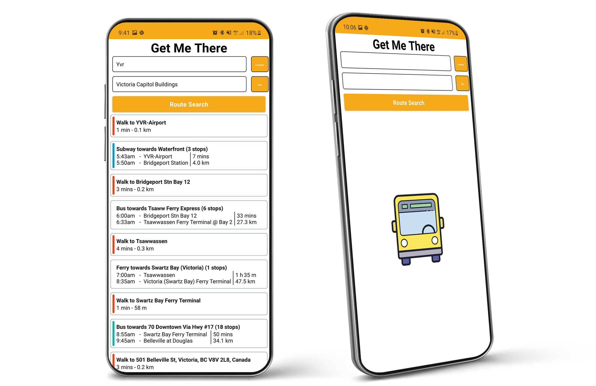

<h1 align="center">
		<a href="https://github.com/MNThomson/GetMeThere">
			
		</a>
	<br>
		GetMeThere
	<br>
</h1>
<h4 align="center">
	Android App that displays the fastest transit route between locations with route and turn-by-turn details.
</h4>
<p align="center">
  <a href="https://github.com/MNThomson/GetMeThere/commits"></a>
  <a href="https://github.com/MNThomson/GetMeThere/blob/master/LICENSE"></a>
  <br>
  <a href="https://github.com/MNThomson/GetMeThere"></a>
</p>

---
<p align="center">
	
</p>

## About

GetMeThere is built with React Native with not even a trace of expo! This projects furfills the need of people with limited or expensive data as it takes only  ~`50kb` of data per route. And once a route is loaded, no more data is required! The data requirements are extremely lightweight compared to Google/Apple Maps because of the lack of interactive map. These maps are a serious data drain as they are downloading new map tiles on every swipe, zoom and tap.

GetMeThere is currently in the MVP (Minimal Viable Product) stage and development has only just begun!

## Install

Creake an Andriod development APK for `GetMeThere` from the command line:
```sh
$ git clone https://github.com/MNThomson/GetMeThere.git
$ cd GetMeThere
$ ./android/gradlew assembleRelease
```

## Setup

A file `example.env` is provided. Rename this to `.env` in the top level directory. Insert a Google API Key which has Maps and Transit API permissions.

## IOS

IOS theoretically should just work...but no testing has been done as a result of the lack of Apple devies